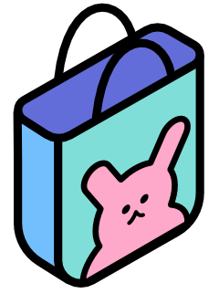

[![shopbit-gif]](https://github.com/rogseo/shopbit)

## About

<u>This project is not being maintained.</u>
 
Shopbit is an e-commerce website that lets users shop or list items for sale.

### Features

- Create an account or log in
- Browse products and view details
- Add products to cart

### Built With

- [Nextjs](https://nextjs.org/)
- [Reactjs](https://react.dev/)
- [MUI](https://mui.com/)
- [Apollo GraphQL](https://www.apollographql.com/)
- [TypeScript](https://www.typescriptlang.org/)
- [Swiper](https://swiperjs.com/)

## Using the app

### Step by step

1. Sign Up or log in
2. Browse products
3. Choose product size, color, etc.
5. Go to cart and follow check-out instructions

## Contact

Yeon Seo - Back end developer
 

Alexis Woelffer - Front end developer
 

<!-- Images -->

[shopbit-gif]: ./content/shopbit.gif

(<a href="#readme-top">back to top</a>)

